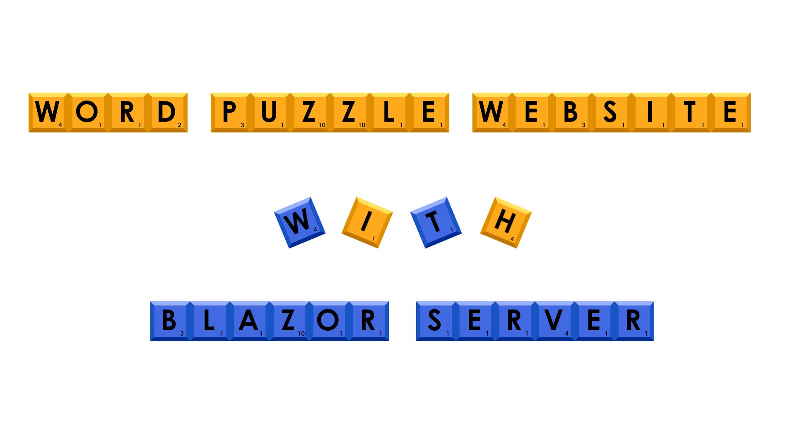
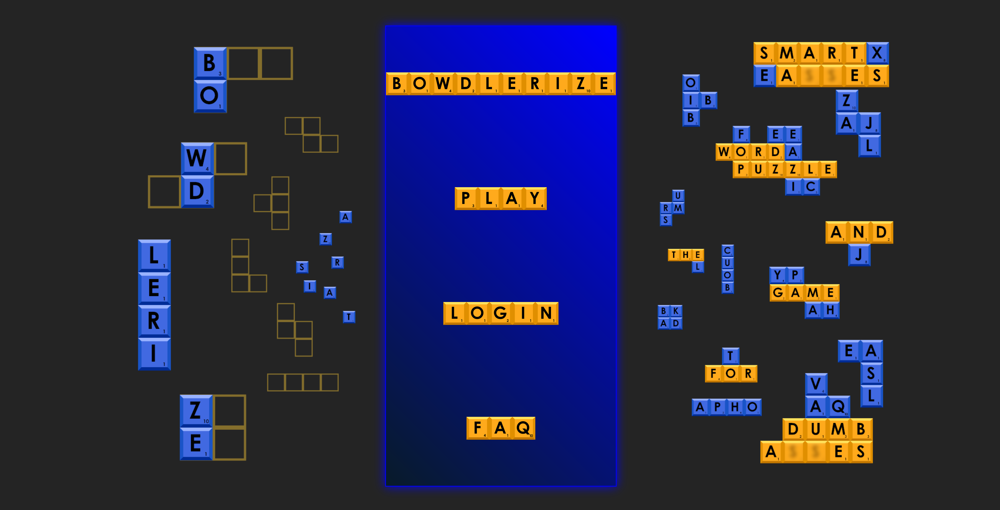
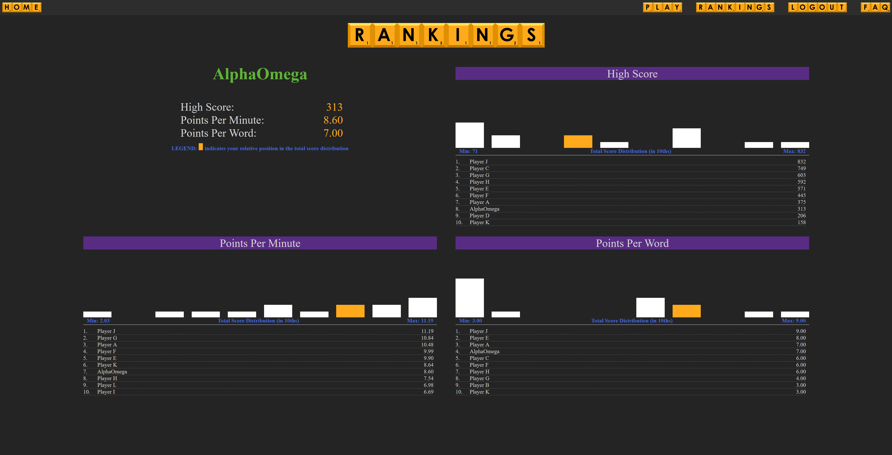

<div align="center">
  
</div>


## Table of Contents
* <a href="#about-the-project">About the Project</a>
    * <a href="#description">Description</a>
    * <a href="#built-with">Built With</a>
* <a href="#getting-started">Getting Started</a>
    * <a href="#prerequisites">Prerequisites</a>
    * <a href="#setup-and-use">Setup and Use</a>
* <a href="#auxiliary-information">Auxiliary Information</a>
    * <a href="#research-&-planning-log">Research & Planning Log</a>   
    * <a href="#license">License</a>  
------------------------------

## About the Project

### Description  
An ASP.NET Blazor Server website for a word puzzle game (***not*** included). Developed as a capstone project at [Epicodus](https://www.epicodus.com/). 

<div align="center">
  
</div>

#### Functionality:
<ul>
<li><input checked="" disabled="" type="checkbox">All visitors can view the fully-functional splash and login/register pages, as well as the game and FAQ pages which contain placeholder images.</li>
<li><input checked="" disabled="" type="checkbox">Visitors can register for an account on the login/register page.</li>
<li><input checked="" disabled="" type="checkbox">Authenticated users can view an additional leaderboards page with full functionality.</li>
</ul>

#### Features: 
<ul>
<li><input checked="" disabled="" type="checkbox">Interactive splash and login/register pages.</li>  
<li><input checked="" disabled="" type="checkbox">Authentication using Microsoft ASP.NET Core Identity.</li>  
<li><input checked="" disabled="" type="checkbox">Dynamic views/access based on authentication.</li>  
<li><input checked="" disabled="" type="checkbox">MySQL database with seeded game data.</li>  
<li><input checked="" disabled="" type="checkbox">Leaderboards page displaying top ten rankings for all-time high scores, points-per-word and points-per-minute, as well as relative position among all active players.</li>
</ul>  


<div align="center">
  
</div>

### Built With  
* [Visual Studio 2022](https://visualstudio.microsoft.com/)
* [C#](https://docs.microsoft.com/en-us/dotnet/csharp/), [CSS](https://www.w3.org/TR/CSS/#css) and [JavaScript](https://ecma-international.org/publications-and-standards/standards/ecma-262/)
* [ASP.NET Core 7.0 Blazor](https://learn.microsoft.com/en-us/aspnet/core/blazor/?view=aspnetcore-7.0)
* [Entity Framework Core 7.0.14](https://docs.microsoft.com/en-us/ef/core/)  
* [Entity Framework Core Tools 7.0.14](https://learn.microsoft.com/en-us/ef/core/cli/dotnet)
* [AspNetCore Identity 7.0.14](https://learn.microsoft.com/en-us/aspnet/core/security/authentication/identity?view=aspnetcore-7.0&tabs=visual-studio)
* [MySQL 8.0.34](https://dev.mysql.com/)


------------------------------
## Getting Started

### Prerequisites

#### Install .NET Core
* On macOS Mojave or later
  * [Click here](https://dotnet.microsoft.com/download/thank-you/dotnet-sdk-2.2.106-macos-x64-installer) to download the .NET Core SDK from Microsoft Corp for macOS.
* On Windows 10 x64 or later
  * [Click here](https://dotnet.microsoft.com/download/thank-you/dotnet-sdk-2.2.203-windows-x64-installer) to download the 64-bit .NET Core SDK from Microsoft Corp for Windows.

#### Install dotnet script
 Enter the command ``dotnet tool install -g dotnet-script`` in Terminal for macOS or PowerShell for Windows.

#### Install MySQL Workbench
 [Download and install the appropriate version of MySQL Workbench](https://dev.mysql.com/downloads/workbench/).

#### IDE / Code Editor

  To view or edit the code, you will need an integrated development environment or code editor.

  1) Microsoft's Products:
     * IDE: [Visual Studio](https://visualstudio.microsoft.com/vs/)
     * Code Editor: [VisualStudio Code](https://code.visualstudio.com/)
  2) Click the download most applicable to your OS and system.
  3) Wait for download to complete, then install -- Windows will run the setup exe and macOS will drag and drop into applications.


### Setup and Use

  #### Cloning

  1) Navigate to the [Word Puzzle Website repo here](https://github.com/rbarcode/WordPuzzleWebsite).
  2) Click the green Code button to reveal the 'Clone' option using HTTPS and a url ending with .git.
  3) Open up your system's terminal or GitBash and navigate to the location you would like install the project by using the `cd` command.
  4) Clone the repository to your desktop: `git clone https://github.com/rbarcode/WordPuzzleWebsite.git`
  5) Run the command `cd ./WordPuzzleWebsite` to enter into the project directory.
  6) View or Edit: Run the command `code .` to open the project in your default IDE/code editor for review and editing.


  #### Download

  1) Navigate to the [Word Puzzle Website repo here](https://github.com/rbarcode/WordPuzzleWebsite).
  2) Click the green Code button to reveal the 'Download ZIP' option (at the bottom of the dialog box).
  3) Click 'Download ZIP' and extract.
  4) Open by double clicking on any of the files to open in a text editor, or open your system's terminal or GitBash in the directory and run the command `code .`.

  #### AppSettings

  1) Navigate into the directory called "CapstoneBlazorServerSite" and create a new file named `appsettings.json`.
  2) Add in the following code snippet to the new `appsettings.json` file:
  
  ```json
{
    "Logging": {
        "LogLevel": {
        "Default": "Warning"
        }
    },
    "AllowedHosts": "*",
    "ConnectionStrings": {
        "DefaultConnection": "Server=localhost;Port=3306;database=word_puzzle_website;uid=[YOUR-USERNAME-HERE];pwd=[YOUR-PASSWORD-HERE];"
    },
}
  ```
  3) Change the server, port, and user id as necessary. Replace `[YOUR-USERNAME-HERE]` and `[YOUR-PASSWORD-HERE]` with your personal MySQL username and password (set at installation of MySQL).
   
  #### Database
  1) From the CapstoneBlazorServerSite directory, run the command `dotnet ef database update` in the terminal to generate the database through Entity Framework Core.
  2) (Optional) To update the database with any changes to the code, run the command `dotnet ef migrations add <MigrationsName>` which will use Entity Framework Core's code-first principle to generate a database update. After, run the previous command `dotnet ef database update` to update the database.

  #### Launch the Site
  1) From the CapstoneBlazorServerSite directory in the terminal, run the command `dotnet watch run`; or you can use the debug tools in your IDE.  

  2) You can browse the site with limited access as a non-registered user.

  3) Using the main menu on the splash page, you can navigate to the login/register page to create a new account.  

  4) Alternatively, you can log in using the credentials below for a user with the user name "AlphaOmega": 
  > Email: ao@ao.com  
  > Password: infinity  
  >
  > *Using the AlphaOmega credentials permits you to see AlphaOmega's relative position in the histogram leaderboards. (New users are **not** included in the histograms because their default scores are zero).*

------------------------------
## Auxiliary Information  

### Research & Planning Log

#### <u>Friday 12/1</u>

* **8:15am:** Start tutorial on using HttpContext in Blazor Server:  
[Using the HttpContext in Blazor Server the right way](https://www.youtube.com/watch?v=Eh4xPgP5PsM)

* **9:15am:** Start researching Blazor Server project architecture (example GitHub repositories, etc.):  
https://github.com/AdrienTorris/awesome-blazor#sample-projects  
https://github.com/dotnet/blazor-samples

* **10:00am:** Start watching tutorial on implementing authentication in Blazor Server from scratch  
[How to implement authentication in Blazor Server from scratch](https://www.youtube.com/watch?v=LBByZRhyZ8U ) 

* **1:00pm:** Return from lunch and start working on adding authentication to Blazor Server app.

#### <u>Friday 12/8</u>  
* **8:05am:** Start researching leaderboard database/table architecture.  

* **8:45am:** Start researching charts in Blazor.  

* **9:30am:** Continue researching charts in Blazor, including watching some tutorials.  
[Blazor Bar Chart Component](https://www.youtube.com/watch?v=z6AHBFGzqQ0)  
[Blazor : Pie Chart and Donut Chart Example || MudBlazor](https://www.youtube.com/watch?v=08lN-o7rQgg) 

* **10:15am:** Start reading MudBlazor documentation and continue researching charts in Blazor (and watch more tutorials).  
https://mudblazor.com/docs/overview  
https://mudblazor.com/components/barchart#custom-svg-content  
[Blazor Column Chart Component](https://www.youtube.com/watch?v=aM54Gjn5lIA)  

* **11:00am:** Start designing UI layout for leaderboard page using Affine.  

* **12:00pm:** Break for lunch.  

* **1:00pm:** Start implementing EF Core database logic in project.  

#### <u>Friday 12/15</u>  
* **8:05am:** Start watching tutorial on UI design for login page.  
[Login and Registration Form in HTML & CSS](https://www.youtube.com/watch?v=mefhyo7W3nk)  

* **8:40am:** Continue watching tutorial on UI design.  

#### <u>Affiliated Repositories</u>
* [Login / Register Page UI Mock Up](https://github.com/rbarcode/CapstoneAuthUIMockUp.git)  

### License  

© 2023 Richard Barbour II  